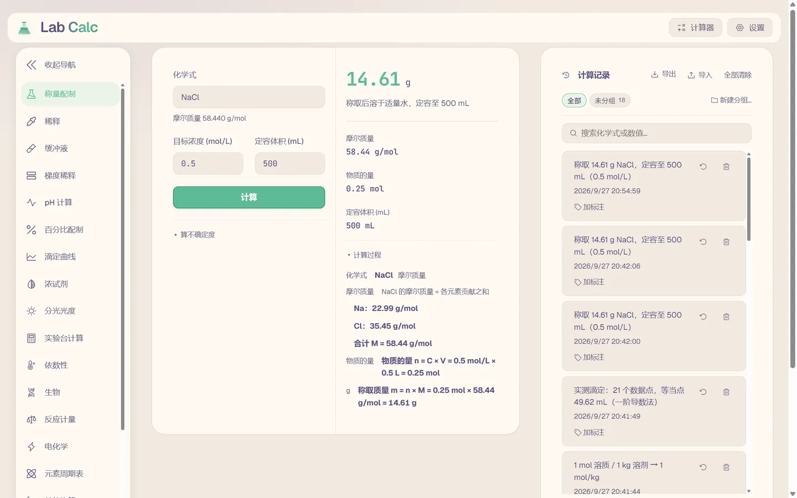
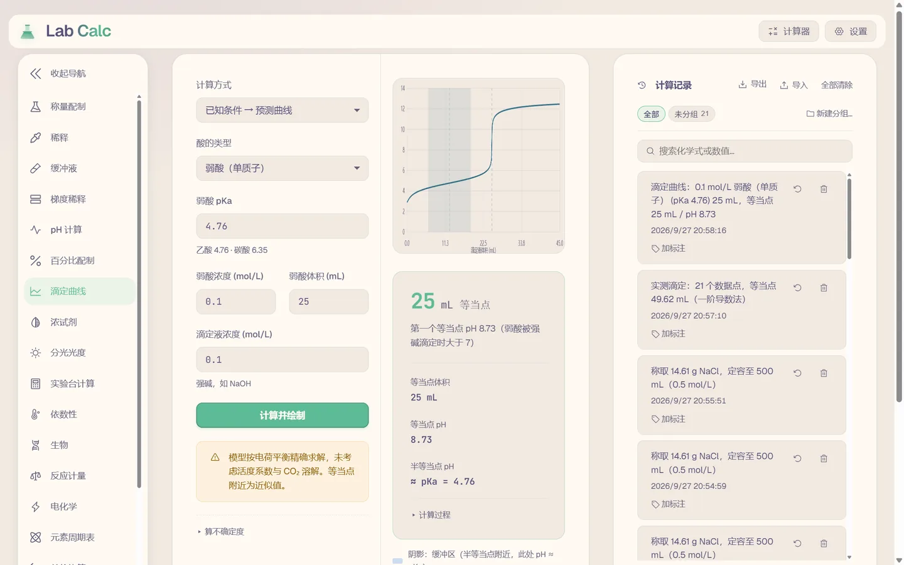
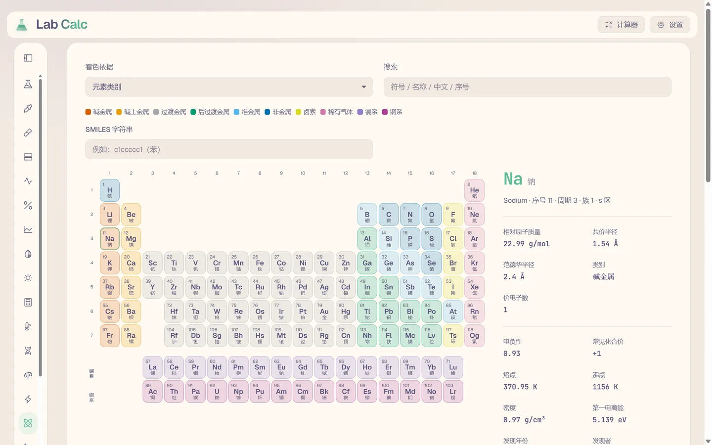
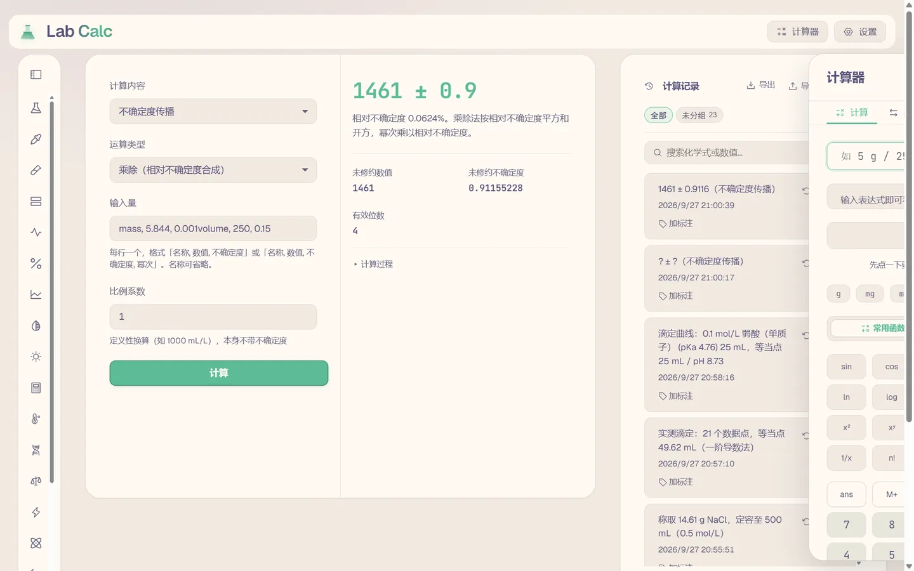

# Lab Calc

**实验室溶液计算器。20 个计算标签页，每次计算自动留存，可搜索、可重算、可导出。**

面向化学、生物、药学实验室的日常配制与计算。与同类工具的区别只有一点：**算完不丢**——每次计算的输入与结果自动进入本地记录。算术部分是标准教科书公式，谁都能写对；留存才是那个没人做的东西。

[**在线使用**](https://acrot0.github.io/lab-calc/) · 无需安装 · 可离线使用（PWA）· 数据只存在你自己的设备上

[English](README.en.md)



*不需要注册，不需要上传，打开就能算——算完的记录留在右侧，不会随页面刷新消失。*

---

## 目录

- [使用范围与模型边界](#使用范围与模型边界) — 先读这一节
- [功能](#功能)
- [为什么做这个](#为什么做这个)
- [计算结果如何留存](#计算结果如何留存)
- [不确定度从哪里来](#不确定度从哪里来)
- [设计取舍](#设计取舍)
- [怎么装](#怎么装)
- [结构](#结构)
- [素材来源](#素材来源)

## 使用范围与模型边界

**本工具用于教学演示与日常学习，不可用于临床、诊断、生产或任何有法规要求的场景。**

首次打开会显示完整的使用须知，确认后可随时从页脚重新打开。须知里逐条写明模型局限，而不是笼统的免责声明。

写明这些不是为了免责，是因为一个看起来权威、实则按理想溶液计算的结果，会被信任到超出它应得的程度。

### 已校正的

缓冲液、pH 计算、浓试剂三个标签页：

| 项 | 做法 | 适用范围 |
|---|---|---|
| 活度系数 | Davies 方程 `log₁₀γ = −A·z²(√I/(1+√I) − 0.3I)` | I ≤ 0.5 mol/L，超出时界面标注 |
| 温度对 pKa 的影响 | van 't Hoff 积分式，11 个常见缓冲体系带 ΔH | 0–50 °C |
| 离子强度 | 由电中性反推抗衡离子，不是硬编码 1:1 | 同上 |

配比与 pH 的关系不再是纯 Henderson–Hasselbalch：先由配比解出氢离子浓度，再代入活度校正。

中性酸（乙酸）的校正**会相消**——γ_H 与 γ_A 相等，pH 偏移在 I 从 0 到 0.1 之间只有 0.0008。这是对的，不是 bug：一个把乙酸"校正"掉 0.05 的计算器教的是错机理。

pH 标签页给出同样的两个数并排：理想模型与活度校正后。校正需要两个 pKa 不携带的输入——酸型电荷 z 与背景离子强度 I，两者默认 0（此时校正归零，返回理想答案）。**带电酸才会移动**，I = 0.1 实测：

| 酸 | z | 理想 | 校正后 |
|---|---|---|---|
| 磷酸 pKa₂ | −1 | 4.100 | 3.993 |
| 铵 | +1 | 5.125 | 5.232 |
| 乙酸 | 0 | 2.880 | 2.884 |

校正量在 I ≈ 0.5 达峰后回落，超过该点界面标注不可信。

**实测判据**：Tris 在 4 °C，理想算法给 7.37，校正后 8.08（pKa 从 8.06 升到 8.69，活度再推 0.08）；磷酸缓冲液 I = 0.2 时 pH 偏移 −0.38。

### 未建模的

所有标签页均不处理：

- CO₂ 溶解（敞口放置的碱液会吸收 CO₂，pH 会漂）
- 溶剂体积收缩（乙醇/水混合体积不守恒）
- 杂质与络合平衡（EDTA、柠檬酸等配体的络合未计入）
- 滴定曲线在等当点附近为近似值

按配制量回答的标签页（溶液配制、稀释等）仍按理想溶液处理——**活度不影响称多少克**。

任何实际配制前，请与教材、药典或试剂说明书**对照核对**。

## 功能

20 个标签页，每个标签页是一类计算；有模式选择的标签页（如生物、分析化学）在标签页内切换子计算。

| 标签页 | 算什么 |
|---|---|
| **称量配制** | 配一定浓度/体积的溶液要称多少克固体 |
| **稀释** | 从母液配目标浓度，取多少母液、加多少溶剂 |
| **缓冲液** | Henderson–Hasselbalch：目标 pH 下的酸/碱配比 |
| **梯度稀释** | 逐级稀释系列，每管取哪一管、取多少、加多少溶剂 |
| **pH 计算** | 弱酸/弱碱溶液的 pH（含常见缓冲体系 pKa 预设，带酸型电荷）；理想值与活度校正值并排显示 |
| **百分比配制** | w/v 百分比与摩尔浓度互转，超溶解度时警告 |
| **滴定曲线** | 弱酸 / 强酸 / 多元酸滴定曲线，按电荷平衡精确求解，标注全部等当点 |
| **浓试剂** | 从浓试剂（37% HCl 等）配目标浓度：百分比/密度 ↔ 摩尔浓度、当量浓度、质量摩尔浓度、离子强度 |
| **分光光度** | Beer–Lambert 正反算 + 标准曲线拟合，反推未知浓度并检查线性范围 |
| **实验台计算** | 摩尔↔质量↔体积互转、平板菌落计数（CFU/mL）、核酸浓度与拷贝数、Master Mix 配液 |
| **依数性** | 沸点升高 / 凝固点降低 / 渗透压，含解离因子 i；也可由 ΔT 反推摩尔质量 |
| **单位换算** | 质量 / 体积 / 浓度单位互换（跨维度会被拒绝，不会静默给错值）|
| **反应计量** | 配平化学方程式（精确有理数零空间，非最小二乘拟合）、限量试剂、产率、经验式 |
| **电化学** | Nernst 方程、电池电动势、平衡常数 |
| **元素周期表** | 118 种元素，含电子排布与价电子数；按类别/电子层区块/原子量/半径着色，键盘方向键导航，可按族（"卤素"）搜索 |
| **生物** | 8 个子计算：核酸定量、纯度比值（260/280）、稀释、寡核苷酸浓度、细胞接种体积、倍增时间、离心换算（RPM ↔ RCF）、酶动力学 |
| **不确定度** | 3 个子计算：摩尔质量的不确定度、不确定度传播、称量配液的总不确定度。见[下节](#不确定度从哪里来) |
| **实验数据** | 重复测量描述统计（均值/标准差/标准误/RSD/中位数/极差/置信区间）、Grubbs 与 Dixon 离群检验、t 检验与 F 检验 |
| **分析化学** | 7 个子计算：EDTA 络合滴定、氧化还原滴定、重量分析、回收率与加标、检出限与定量限、色谱分离、溶解度与络合平衡 |
| **物理化学** | 5 个子计算：反应动力学、Arrhenius 活化能、电导率、热力学、相图与低共熔点 |

历史记录可导出为 **Excel 表格（.xlsx）**、**CSV**（含 BOM 防中文乱码）、**Markdown**（直接贴进实验记录本）、**PDF 报告**（浏览器打印，矢量文字可搜索）或 **JSON 备份**（可再导入，换电脑不丢）。



<details>
<summary>展开：元素周期表与不确定度传播</summary>





</details>

Excel 导出把每个输入输出放成独立一列，可直接排序筛选作图；PDF 报告带字段中文名，是能贴进实验记录本的形式。

### 滴定曲线求解方式

不用 `[H⁺] ≈ √(Ka·C)` 近似——该式假设酸几乎不解离，在等当点附近完全失效，而那正是曲线存在的意义。改为在每个滴定体积下解电荷平衡：

```
[Na⁺] + [H⁺] = [OH⁻] + C_acid · z̄([H⁺])
```

`z̄` 是酸的平均电荷，由全部质子化态的分布算出。单元酸退化为大家熟悉的 `[A⁻] = C·Ka/(Ka+[H⁺])`。

**实测判据**：乙酸半等当点 pH = 4.76 = pKa；盐酸等当点 pH = 7.00；磷酸三个等当点 25/50/75 mL，三个半等当点分别落在 pKa₁₂₃。

### 溶解度与络合平衡：为什么需要联立求解

溶度积单独给不出溶解度。实测：AgCl 在纯水中溶解 1.33×10⁻⁵ mol/L，在 1 mol/L 氨水中溶解 0.055 mol/L——**同一个 Ksp，相差 4000 倍**。原因是二氨合银把自由 Ag⁺ 压到 5.4×10⁻⁹ mol/L，固体必须继续溶解才能维持离子积。

CaCO₃ 是另一种耦合：阴离子自己就是碱。pH 7 时碳酸几乎全是 HCO₃⁻，而 HCO₃⁻ 不出现在 Ksp 表达式里，所以实际溶解度是 √Ksp 的 51 倍。

这类问题没有闭式解，本页直接解方程本身：每个物种的质量作用式、每个组分的质量守恒、每个固体的溶度积，用 Newton–Raphson 联立。未知量取 `pX = −log₁₀[X]` 而非浓度——形态分布跨 7 个数量级，按浓度迭代时 Jacobian 列相差 7 个数量级，线性求解会把小量丢给舍入。

四个内置体系（AgCl/水、AgCl/氨水、CaCO₃/水、Cu²⁺–NH₃ 逐级络合）的常数都是 25 °C、I → 0 的热力学值，并注明出处——形态分布的可靠性完全取决于常数，用户核对不了输入就核对不了结果。

**已知局限**：没有活度模型（因此常数必须是热力学值，喂条件常数等于把离子强度算两遍）；金属水解、混合配体、列表之外的离子对都不在模型内。每一项都让模型**高估**溶解度——方向是「预测比实际溶解得多」，而不是相反。

### 计算后的图表

六个标签页在算出结果后可以展开一张图。选这些、不选别的，判据是**图能不能改变结论**，而不是图好不好看：

| 图 | 页面 | 图能说出而数字说不出的话 |
|---|---|---|
| 滴定曲线 | 滴定曲线 | 等当点附近斜率有多陡——缓冲容量在哪里耗尽 |
| 标准曲线 + 残差 | 分光光度 | 拟合是否真的描述了数据，还是只是在几个点上穿过去 |
| 酶动力学曲线 | 生物 | 底物范围有没有跨过 Km。五个点全在 Km 以下的拟合，参数看着很有底气，数据里却没有 Vmax 的信息 |
| 各形态分布 | pH 计算 | `[H⁺] ≈ √(Ka·C)` 的适用范围在哪失效：酸型占比掉到 1% 以下时它已经不成立 |
| Nernst 直线 | 电化学 | 反应商还能移动多远才到平衡。斜率本身就是 RT·ln10/nF，改温度或改 n 会看到线绕 lg Q = 0 转动 |
| 产量随投料量 | 反应计量 | 多加一点某个反应物到底有没有用。答案是折线在化学计量比处拐平——加过量不再增产，而这件事在一行结果里看不出来 |

**Nernst 直线的横轴只取工作点两侧各一个数量级**，不会为了画到 E = 0 而拉长。第一版拉长了，理由是「交点才是重点」——对大多数电池不成立：lg K = nE°/0.05916，丹尼尔电池（E° = 1.1 V、n = 2）在 lg Q ≈ 37 才到平衡，画 38 个数量级会把线压成一条缝、95% 的画布是空的。所以交点在窗口内才画，不在时图注改说「这支电池离平衡太远（lg K = …）」。**标记出现本身就意味着「你离平衡在一个数量级以内」**——这是电池的性质，不是坐标轴的偶然。

### 操作步骤流程图

四个配制标签页（称量配制、稀释、缓冲液、梯度稀释）在算出结果后可展开一张流程图：每一步一个方框，箭头连接，按顺序向下。

文字步骤本来就有——Markdown 导出和打印报告里一直是编号列表。流程图加的是列表说不出的事：**第 2 步依赖第 1 步，顺序不可调换**。配溶液是一步错就全废的事，而这一点在一串并列的编号里看不出来。

方框左侧的色条表示步骤类别（称量、转移、调节），扫一眼就能找到称重那一步，不用读完全部。图可导出为独立 SVG（配色已内联，不依赖本应用）。

## 为什么做这个

溶液计算器遍地都是，但它们有个共同点：**算完就没了。**

一周后想知道「上次那个缓冲液怎么配的」，你只能翻实验记录本、翻聊天记录、或者重算一遍。而重算意味着重新输入所有参数，还要担心记错了浓度。

电子实验记录本（ELN）能解决，但它太重了——要建项目、选模板、填表。为一次两行算式付出这个代价不值得。

**中间那层是空的：一个计算器，顺手把每次计算留下来。**

这正是本项目的全部差异化所在。算术部分是标准教科书公式，谁都能写对；**留存**才是那个没人做的东西。

## 计算结果如何留存

| 能力 | 做法 |
|---|---|
| 自动留存 | 每次计算写入一条记录（`kind` / `inputs` / `outputs`），不需要额外操作 |
| 搜索 | 按化学式或数值搜索历史 |
| 重算 | 还原参数并跳转到对应标签页 |
| 批量缩放 | 把已保存的配方按倍数重算成新记录（原记录不动），例如 500 mL 的配方按 2× 缩放 |
| 删除 | 标记删除（`deletedAt` 墓碑）+ 回收站 + 即时撤销条，而非直接抹除 |
| 分组与标注 | 记录可分组、可加标注 |
| 导出 | Excel / CSV / Markdown / PDF / JSON |

**存储位置**：浏览器 `localStorage`，不上传任何数据。存储不可用（Safari 隐私模式、配额满）时自动降级到内存，计算功能不受影响，只丢历史。

## 不确定度从哪里来

这是本工具与通用不确定度计算器的区别所在。

通用不确定度计算器要求用户**自己填**每个量的不确定度——也就是说，用户必须先知道答案的一部分。Lab Calc 反过来：用户只填实验参数（浓度、体积、容量瓶等级），不确定度由内置的领域数据推出来。

| | 通用不确定度计算器 | Lab Calc |
|---|---|---|
| 输入 | 用户填每个量的不确定度 | 用户只填实验参数 |
| 不确定度从哪来 | 用户必须**已经知道** | 内置玻璃器皿公差与天平项 |
| 输出 | 一个合成值 | 一个 ± 加上每一项来源的贡献分解 |
| 领域知识 | 无（通用表达式） | 知道 A 级容量瓶比 B 级准多少 |

内置数据来源：

| 项 | 来源 |
|---|---|
| 容量瓶（A 级） | ISO 1042 / ASTM E288 |
| 单标线移液管（A 级） | ISO 648 / ASTM E969 |
| 天平（称量项） | Eurachem QUAM:2012 §8.1.4 |

公差按**矩形分布**折算为标准不确定度（ASTM E288 §1.1.3），这是保守方向：矩形分布给出的标准不确定度比正态假设大。

七个标签页给出带 ± 的结果与贡献分解：称量配制、稀释、百分比配制、浓试剂、分光光度、滴定曲线、生物。

## 设计取舍

**未知元素报错，不静默跳过。** `Xx2O` 会报错而不是当成 2 个氧。静默跳过会给出一个看起来对、实则错的摩尔质量，而用户没有机会发现。

**拒绝不可能的操作。** 目标浓度高于母液时，稀释计算会报错——那是稀释做不到的事。返回一个数字会让人照着配出一份错误溶液。同理，质量单位换算成体积单位会报错：`1 g → mL` 需要密度，而换算函数无从得知；两者系数都是 1，直接相除会返回输入值本身。

**化学式里没有"差不多"。** `Na0Cl`（下标 0）、`Ca()2`（空括号）、`H2O·5`（连接点后无内容）、`NaCl.`（尾点）都曾静默通过：下标 0 等于没有这个原子，质量会算成纯氯；空段被过滤掉，`NaCl.` 读作 `NaCl`。每一个都返回"看起来正常"的数，所以每一个都改成报错，并说明具体原因。

**同位素与有机简写按化学读，不按字面读。** `D2O` 是重水（20.027），不是水（18.015）；`DMSO-d6` 的 `-d6` 是把 6 个氢换成氘，所以是 C₂D₆OS。有机简写 `Me`/`Ph`/`Boc`/`TBS` 等会展开。但 `Pr`、`Ac`、`Ar`、`Ts`、`Am` **故意不展开**——它们同时是镨、锕、氩、鿬、镅的元素符号，把 `Pr2O3` 读成丙基会静默改变一个本来正确的化学式的含义。元素读法优先。

**元素类别是显式数据，不由网格位置推导。** 从族/周期推类别看着简洁，但是错的：碳、氮、氧、磷、硫与锡、铅同处 14–16 族，按位置会判成后过渡金属；砹在 17 族会被判成卤素。金属与非金属的分界线是**斜穿**这些列的阶梯线，任何按行列的规则都抓不准——实测 118 个里有 13 个错。类别现在是显式成员表，`categoryOf` 遇到未归类的元素直接抛错而不是给默认值：一个"看起来合理"的默认值正是那 13 个错误标签上线的方式，当时没有任何东西失败，表格只是说了假话。

**缓冲范围会提示。** Henderson–Hasselbalch 对 1000:1 的配比照样算得出 pH，但那个缓冲液几乎没有缓冲能力。算式没错，缓冲液没用——所以会警告。

**主结果不用等宽字体。** 试过，弃了：等宽字体下小数点是颗极淡的点，`14.61` 看起来像 `14 61`。实验室里看错小数点是实质问题，不是审美问题。改用 Geist 的 tabular figures，列对齐且小数点清晰。

**无下界的量一律用 `fmtSci`。** `fmt` 保留固定小数位，这对有下界的量（摩尔质量、半径、百分比、温度、R²）是对的。但**质量、物质的量、浓度没有下界**——1 µM 溶液配 1 mL 需要 5.844×10⁻⁸ g，`fmt` 会把它渲染成 `0`，而 `0` 读作"没有东西"而不是"很少"。所以这两类量分开：无下界走 `fmtSci`（超出 1e-3 ~ 1e5 改用尾数×10ⁿ），有下界留在 `fmt`。`fmtSci` 对常规数值的输出与 `fmt` 完全一致，所以这个替换除了原本出错的地方以外不可见。`test/ui-strings.test.mjs` 会扫描这个模式；同一个字段名在一处有界、另一处无界时，在调用点写 `Bounded:` 注释显式记录判断，而不是放宽扫描规则。

## 怎么装

同一套代码，四种拿法。都完全离线，都不上传任何数据。

| 形式 | 体积 | 怎么拿 | 适合 |
|---|---|---|---|
| **网页 / PWA** | 0（浏览器缓存） | 打开 <https://acrot0.github.io/lab-calc/>，浏览器菜单选「安装应用」/「添加到主屏幕」 | 最省事。手机、平板、电脑都能装，装完断网也能用 |
| **Android APK** | 3.6 MiB | 从 [Releases](https://github.com/acrot0/lab-calc/releases/latest) 下载 `lab-calc-<版本>.apk`，传到手机点击安装 | 要发给别人、或浏览器没有「添加到主屏幕」的场合 |
| **Windows 安装包（Tauri）** | 3.4 MiB | 下载 `Lab.Calc_<版本>_x64-setup.exe` | **推荐**。体积小、内存低，用系统 WebView2（Win11 自带） |
| **Windows 免安装（Electron）** | 122 MiB | 下载 `labcalc-v<版本>-win-x64.zip`，解压双击 `LabCalc.exe` | 完全自包含：自带浏览器引擎，不依赖系统组件 |

四个产物都会随 tag 一起附在 release 上，`scripts/check-release-assets.mjs` 在**发布前**比对这张表和实际附件，缺一个就 fail——这张表在 v0.9.1 和 v0.9.2 都只兑现了四分之一，靠的是没人点那个链接才没被发现。

Electron 版和 Tauri 版是同一个应用的两条打包路径，不是两个功能集。前者把浏览器引擎一起带上（所以大，但在任何 Windows 上都一样），后者用系统已有的 WebView2（所以小，但依赖那个组件可用）。**默认用 Tauri 版；机器上 WebView2 缺失或损坏时用 Electron 版。**

体积一栏写的是实测值（单位 MiB，1 MiB = 1.048576 MB），不是估计：APK 与 Electron 包的大小来自 `scripts/package-*.mjs` 每次构建的实测输出，安装包来自 `gh release view` 的字节数。写「约 5 MB」看起来更安全，但那个「约」会慢慢替一个不再成立的数字打掩护。

**Android 版用正式密钥签名**，证书 `CN=acrot0`，RSA 4096，有效期至 2056 年。签名指纹：

```
SHA-256  62:10:CE:17:86:74:A0:85:1D:77:5D:EB:42:88:1A:37:BE:20:78:B9:37:60:C2:5E:BF:9B:5E:F5:92:7C:CD:08
SHA-1    B8:2E:6B:A6:7F:FB:8D:34:31:37:FE:50:C3:AD:26:F3:69:C0:DB:D1
```

这是发布包的身份，不是格式声明：拿着密钥的人可以发布一份所有已安装副本都会当作正版接受的更新，而 Android 没有吊销机制。keystore 与口令不入库（见 [docs/RELEASE.md](docs/RELEASE.md)），在别处备份。核对一个 APK 是否出自本项目，用 `apksigner verify --print-certs` 比对上面的指纹——指纹一致即同一签名，不一致则任何来源都不该装。

手机端的计算器是底部抽屉，触控目标 ≥44px，软键盘弹起时抽屉会抬起来让开；横屏时改成左右两栏，键盘在右、输入和读数在左。

## 开发

```bash
npm install
npm run dev      # 开发服务器
npm run build    # 构建到 dist/，纯静态，可直接托管
npm test         # 2525 个测试
npm run verify   # 导入完整性 + 图标测量 + 许可证 + 署名 + 20 项计算对已知答案的冒烟检查
```

| | |
|---|---|
| **平台** | 网页（PWA）· Windows 桌面（Tauri / Electron）· Android |
| **语言** | 中文 / English 双语 |
| **主题** | 10 套（含 Catppuccin、Rosé Pine、Gruvbox、Solarized）+ 跟随系统 + 自定义强调色/圆角/密度/动效 |
| **导出** | Excel（.xlsx）· CSV · Markdown · PDF 报告 · JSON 备份（可再导入）|
| **许可** | MIT |
| **状态** | v1.1.0 · 测试 2525 通过 / 125 文件 · 三平台 CI 全绿 |

## 结构

```
src/
├── calc/              纯计算函数，无副作用、无 i18n 依赖
│   ├── solution.mjs     分子量、称量、稀释
│   ├── shorthand.mjs    同位素（D/T）与有机简写（Me/Ph/Boc…）展开
│   ├── buffer.mjs       缓冲液、梯度稀释、单位换算
│   ├── titration.mjs    pH、等当点、百分比
│   ├── curve.mjs        滴定曲线（单元/强酸/多元酸）
│   ├── reagent.mjs      浓试剂、当量浓度、离子强度、Beer–Lambert、标准曲线
│   ├── colligative.mjs  依数性（沸点升高/凝固点降低/渗透压）
│   ├── lab.mjs          摩尔换算、菌落计数、核酸、Master Mix
│   ├── reaction.mjs     方程式配平、限量试剂、经验式
│   ├── electro.mjs      Nernst 方程、电池电动势
│   ├── elements.mjs     118 元素数据 + 类别/区块/周期归属
│   ├── config.mjs       电子排布（20 个 Madelung 例外为显式数据）
│   ├── instruments.mjs  玻璃器皿公差与天平项（ISO/ASTM/Eurachem）
│   ├── uncertainty.mjs  不确定度传播与合成
│   └── errors.mjs       错误码（计算层不抛用户可见文案）
└── ui/
    ├── App.jsx           界面外壳
    ├── LocaleContext.jsx 语言 context
    ├── ThemeContext.jsx  主题 context + 切换器
    ├── i18n.mjs          翻译层
    ├── theme.mjs         主题解析（深/浅/跟随系统）
    ├── format.mjs        数值显示（fmt 定小数位 / fmtSci 跨数量级）
    ├── errors.mjs        错误码 → 当前语言的文案
    ├── disclaimer.mjs    教学用途须知（内容 + 确认状态）
    ├── locales/          zh.mjs / en.mjs
    ├── summaries.mjs     历史摘要（渲染时派生，非持久化）
    ├── history.mjs       历史记录（存储接口注入）
    ├── procedure.mjs     配制步骤（配方卡片，导出与流程图共用）
    ├── procedure-flow.mjs 流程图的几何布局（纯函数，无 DOM）
    ├── scale-inputs.mjs  批量缩放的换算与守恒规则
    ├── export.mjs        Excel / CSV / Markdown / PDF 导出
    ├── xlsx.mjs          手写的 .xlsx 生成器（零依赖）
    ├── palettes.mjs      10 套主题配色（含 Catppuccin / Rosé Pine / Gruvbox / Solarized）
    ├── styles.css        设计 token + 组件样式
    ├── tabs/             20 个计算标签页
    └── components/       表单原语、历史面板、须知弹窗、SVG 插画
```

三处刻意的分层：

**计算层不抛用户可见文案。** 抛 `CalcError{code, params}`，由 UI 翻译。否则切到英文后错误信息还是中文，且计算层测试要断言本来属于展示层的散文。

**摘要不持久化。** 记录里只存 `kind/inputs/outputs`，摘要渲染时派生。所以切换语言时，**已有的历史记录也跟着翻译**——存下来的话旧条目会永远停留在当时的语言。

**`history.mjs` 接受注入的存储对象**，而非直接访问 `localStorage`，所以历史逻辑能在 Node 里完整测试。

## 素材来源

| 用途 | 来源 | 许可 |
|---|---|---|
| 界面图标 | [Phosphor Icons](https://phosphoricons.com) | MIT |
| 界面字体 | [Geist](https://vercel.com/font)（正文与标题） | OFL-1.1 |
| 数字字体 | [JetBrains Mono](https://www.jetbrains.com/lp/mono/)（数值，tabular figures） | OFL-1.1 |
| 应用图标 | 本项目 `scripts/make-icons.mjs` 程序化生成 | MIT |

字体只用两种，都由 CSS 变量指定。**没有衬线标题字体**：试过 Instrument Serif，但它没有 CJK 覆盖，三个标题里有两个在中文界面下回退到系统宋体——拉丁衬线与中文宋体并排出现在同一行标题里，是那种「字体不对」却说不清哪里不对的效果。改用 Geist 后，中英标题来自同一族。

均可商用。应用图标是脚本画出来的（`npm run icons`），不依赖外部图片素材——这样颜色与界面 CSS 变量严格一致，且是可复现的文本而非不透明二进制。

## 许可

MIT
